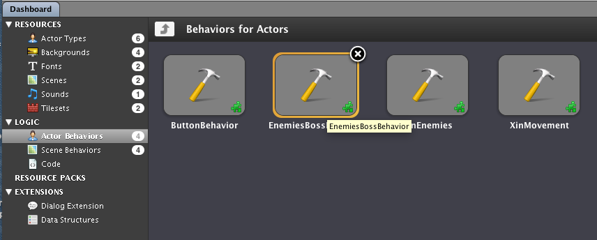
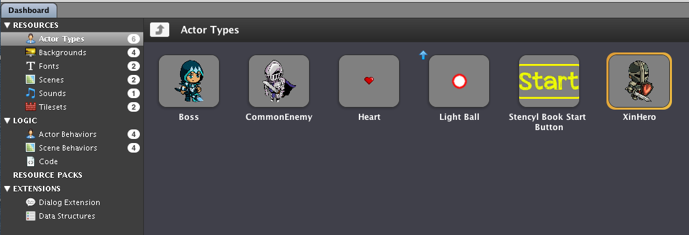
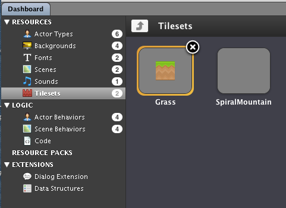
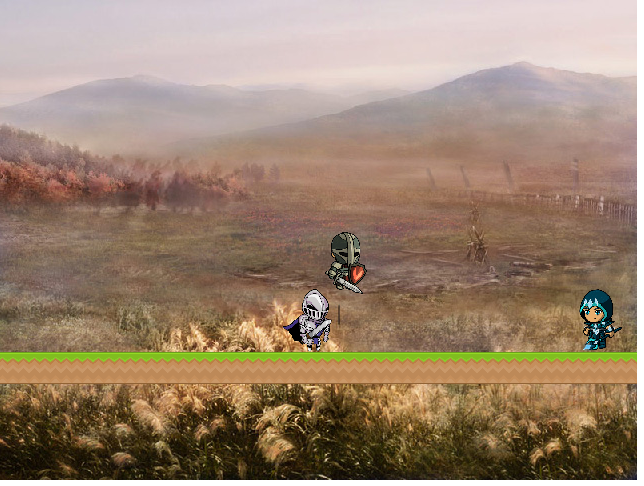
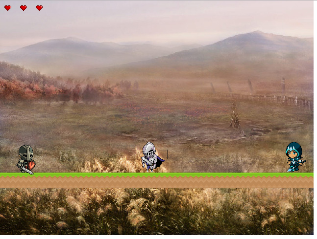
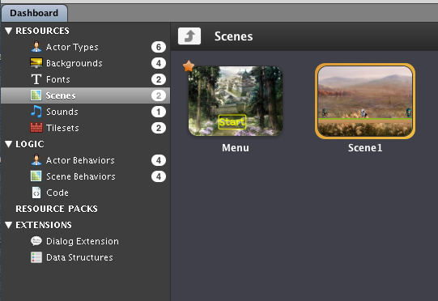

#Scene behavior progress
**1. Scene behaviors display**

**2. Actor behaviors display**

**3. Actors display**

**4. Scene behaviors display**

**5. Tile sets**

**6. Sprint2 play through**

**7. Sprint2 game scenes display**

