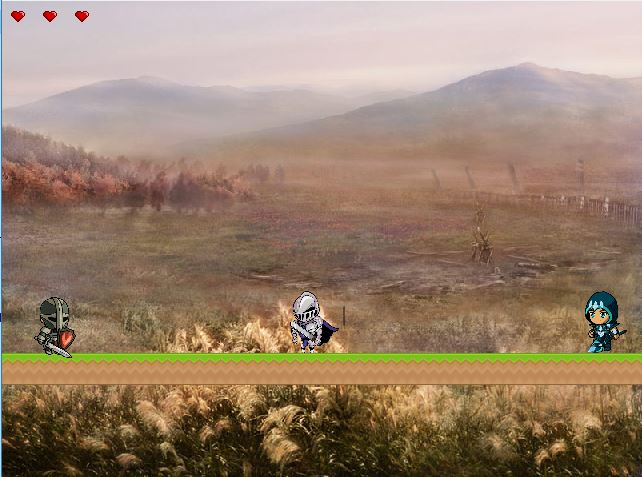

# Finalproject-XinHero-
### Sprint2 
#### In this sprint:
1. [Generating the game requirements specifications by product owner]()

Each member of the team pitched an idea

Each idea was discussed

The team member whose idea vas selected by the team was automatically appointed product owner and was tasked with preparing the game requirements specifications.

2. Review and analysis of these requirements by the team and coming up with clear understanding of what is expected.

The document was analyzed by the the developers to understand the detailed game requirements. 

3. Gathering game assets and creating an asset kit

Game assets were gathered in order to design and implement the game

Assest that fit the theme of the game (chinses characters) were hard to find.

The team, after discussing with the product owner, decided to use whatever assets available.

To maintain the general theme, the scene background was chosen in line with the game theme.

4. depending on the game, the developers enhanced their skills required for the completion of this project

Character attributes' design and creation of scene logic.

5. The Hero’s attributes are developed

Physics

behavior

6. The enemies’ attributes are developed 

Physics

behavior

7. The scene background and tile are completed

8. The scene logic is completed 

#### In the sprint review a number of bugs are detected, among them:

..*the hero was having problem executing the attack in standing/ walking status.
..*There was a gap between the hero/enemy and the tile (they seemed like floating).
..*The hero would disappear when jumping (no scene limits).
..*Further features and improvements are recommended 
..*It was found that it is better to switch the personality of the enemy and the hero. A knight in shiny armor would fit better as a hero, while a soldier in gray armor wouldfit better as an enemy soldier.

[Sprint2](https://github.com/Anesouadou/Finalproject-XinHero-/tree/Sprint-Two)
