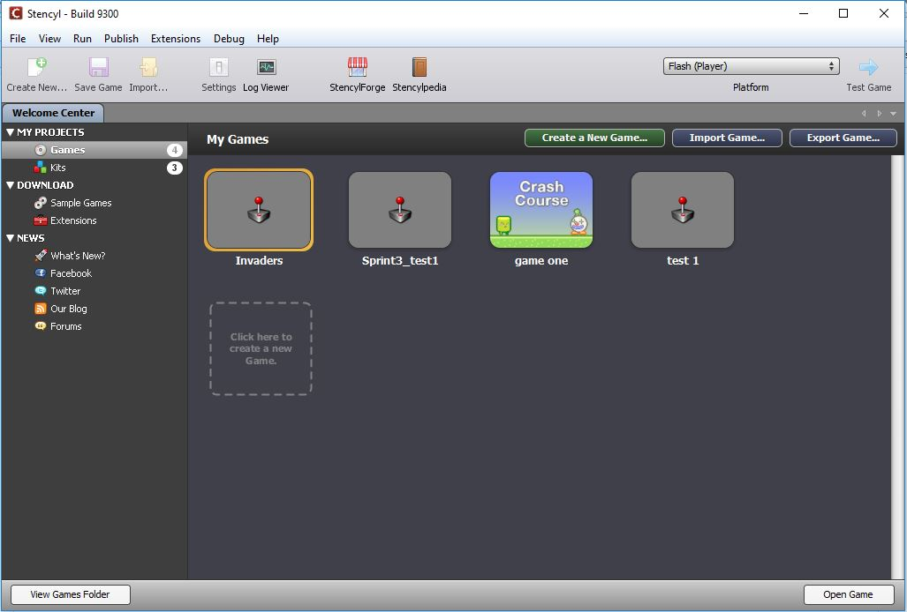
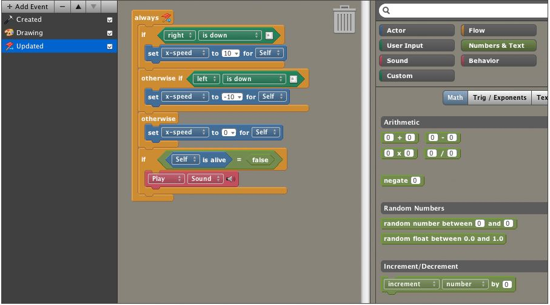

# Finalproject-XinHero-

## Team members

**_product owner_ :** Anes Ouadou
**_scrum master_ :** Wenyi Lu
**_develope team_ :** Xinzhou Liu, Chen Chen, Jianshen Zhu.

## Team Final project explanation vedio:

https://drive.google.com/file/d/1a8Ch6I2GcUx61tITV5CJbWNEzrrNP87K/view?usp=sharing

## Introduction

In this project we designed and implemented a game, in which a hero fights its way through enemey soldiers and genrals The game is two-diemnsional. It is composed of two scenes and can be extended as needed. The game was intened as a depiction of a period of chinese history (the warring state era).

However, because we couldn't find game assets of chinese  heros and soldiers. we used whatever game assets we managed to obtain.game

The knight in shiny armor is the hero.
The soldier in the gray armor is an enemy.

## *Game Engine*
For the development of the game, **Stencyl** game engine was used.

This engine allows us to develop behavior and physics for each character.
It also allows us to develop the logic without having to do the detailed coding.

[Stencyl can be download from this link](http://www.stencyl.com/)

## The game was developed in three sprints

1. Sprint1
[Sprint1](https://github.com/Anesouadou/Finalproject-XinHero-/tree/Sprint-One)

2. Sprint2
![the game as it appears after sprint 2]
[Sprint2](https://github.com/Anesouadou/Finalproject-XinHero-/tree/Sprint-Two)

3. Sprint3
![the game as it appears after sprint 3]
[Sprint3](https://github.com/Anesouadou/Finalproject-XinHero-/tree/Sprint-Three)

## Downloading and playing the game

1. Download the game from the Github repository(https://github.com/chrischen1/Finalproject-XinHero-/blob/master/HeroXinversionFinal.swf).
2. Unzip the folder.
3. Double clic on the .swf file.  
4. Click start.
5. Use the left, right and up arrow keys to move the fighter backward, forward and jump, respectively.
6. Press the letter 'T' to perform an attack.   
